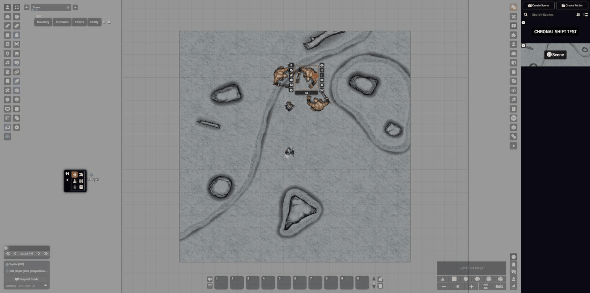
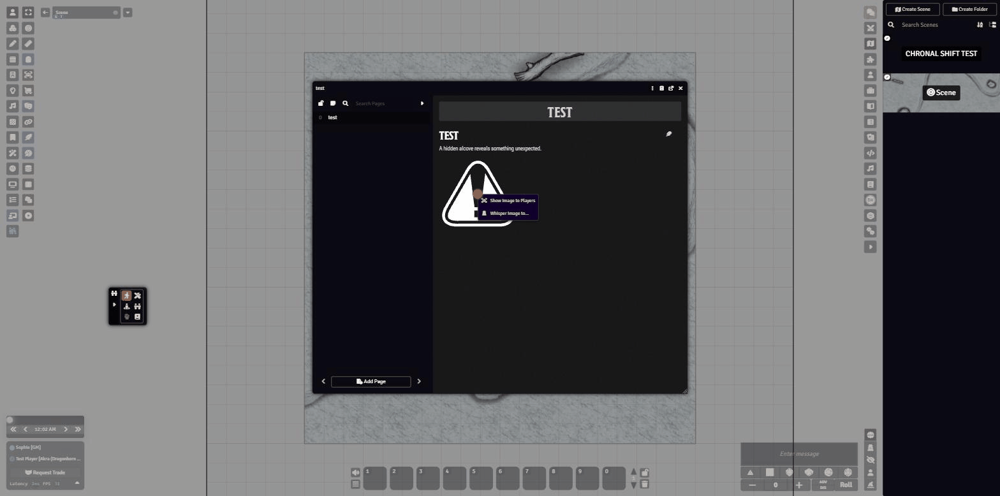
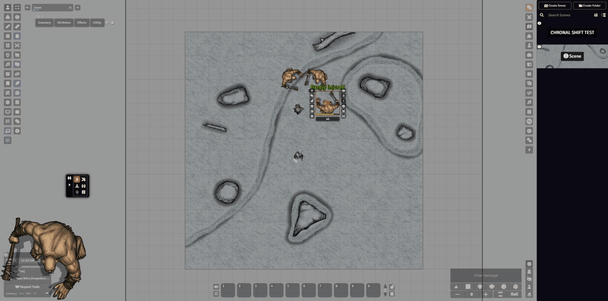
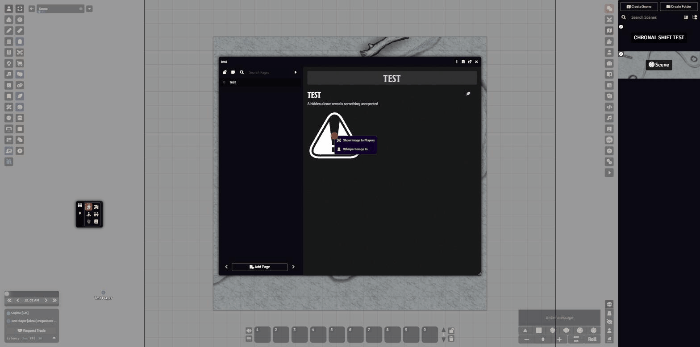
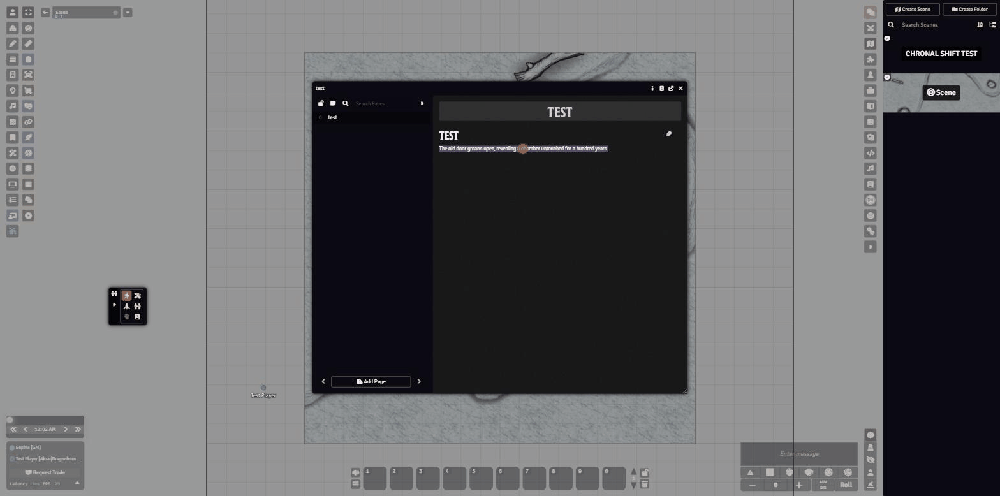

# Show and Tell

A Foundry VTT module for showing and telling: broadcast token portraits and journal images to every player with a single right-click, and a native right-click menu for describing or narrating selected journal text.

## Features

### Show Players (token)

A button on the Token HUD broadcasts that token's actor portrait to every connected client as an auto-closing popout. GMs see it on every token; players see it only on tokens they own.

### Show Image to Players (journal)

Right-click any image inside a journal entry and choose "Show Image to Players" from the context menu to broadcast it the same way, without the click-image → 3-dot-menu → Show Players detour.

### Whisper Show

Show an image to chosen players only, not the whole table. Shift+Click the Token HUD button, or choose "Whisper Image to…" on a journal image, and pick recipients from a small dialog. Handy for a private clue only one player should see.

Targeting is client-side, same as any Foundry module socket message — a real, documented limitation, not a promise of cryptographic privacy.

### Describe / Narrate (journal text)

Select text in a journal entry and right-click for a native context menu with Describe (chat-only) and Narrate (an on-canvas display, visible to everyone, with pause/close/copy controls) options. The menu only appears when text is actually selected — right-clicking journal content with nothing selected does nothing, unlike the module this was built from.

### Also included

- **Chat commands** — `/desc`, `/narrate`, `/note` (GM-only), and `/as [speaker]` all work the same way, independent of the right-click menu.
- **Configurable** — narration appearance (font, color, background, duration), separate auto-close timeouts for token portraits vs. journal images, and per-feature minimum permission levels.

## Attribution

This module combines and extends two earlier projects:

- **[Let's Take a Look](https://github.com/DNDMLunga/lets-take-a-look)** (DNDMLunga) — the original token-portrait broadcast mechanism. Still maintained separately as its own lightweight module.
- **[Narrator Tools](https://github.com/elizeuangelo/fvtt-module-narrator-tools)** by elizeuangelo, licensed under [CC-BY 4.0](https://creativecommons.org/licenses/by/4.0/) — the description/narration chat-command system and on-canvas narration display. Substantial changes were made for Show and Tell: the Scenery tool was removed, the right-click menu was rebuilt on Foundry's native `ContextMenu` component (replacing a hand-rolled popup), the image-broadcast and whisper-show features were added, per-source auto-close timeouts were separated, and multi-language support was reduced to English for this initial release.

Show and Tell itself is also licensed under CC-BY 4.0.

## What's different from Narrator Tools

If you've used Narrator Tools before, note what's intentionally **not** here:

- **No Scenery tool.** The canvas-dimming vignette control (and its F1 keybinding) was dropped — it wasn't connected to this module's actual purpose (narration + image sharing) and was a common source of "why did my scene go dark" confusion.
- **English only, for now.** Narrator Tools shipped 12 languages; this first release ships English only rather than carrying forward translations that would be missing the new strings.

## Installation

Manifest URL: `https://github.com/DNDMLunga/show-and-tell/releases/latest/download/module.json`
